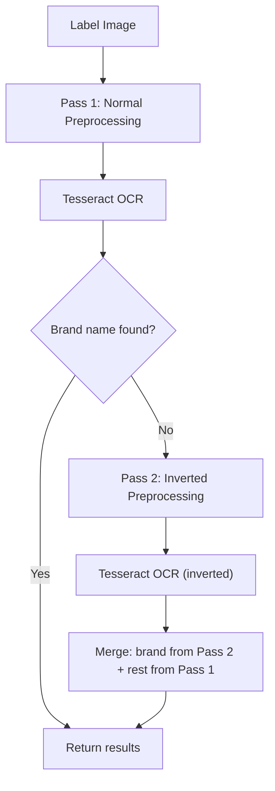

# Fix Brand Name OCR for Decorative Fonts

## Root Cause

Tesseract is trained on **dark text on light backgrounds**. Brand names like "OLD TOM" appear as **light text on dark bottle glass**. Tesseract literally cannot see them -- the text is invisible to it. This is not an extraction bug; the text is absent from the OCR output entirely.

## Strategy: Two-Layer Approach




### Layer 1: Color Inversion Pass (high confidence, zero new dependencies)

**The fix:** When the first OCR pass doesn't find a brand name, run a second pass with **inverted colors** (light-on-dark becomes dark-on-light). This is the exact solution documented on StackOverflow and blog posts for Tesseract's dark background blindness.

Implementation in [src/lib/ocr/preprocessor.ts](src/lib/ocr/preprocessor.ts):

- Add a `preprocessImageInverted()` function that runs the same pipeline but with `sharp.negate()` applied before grayscale
- The OCR engine tries the inverted image only when the first pass returns no brand name

Implementation in [src/lib/ocr/engine.ts](src/lib/ocr/engine.ts) or a new `src/lib/ocr/multipass.ts`:

- `recognizeWithFallback(imageBuffer)` -- runs normal OCR first, checks if brand is missing, runs inverted OCR if needed, merges results

**Why this will work:** "OLD TOM" is light cream text on dark glass. Inverting makes it dark text on light background -- exactly what Tesseract is trained for. The rest of the label (white area) will be garbled in the inverted pass, but we only need the brand name from it.

**Cost:** ~500ms extra when brand is missing (one additional OCR pass). Zero new dependencies.

### Layer 2 (optional): PaddleOCR via @gutenye/ocr-node

A completely different OCR engine based on PaddleOCR PP-OCRv4, running locally via ONNX Runtime. PaddleOCR is known to handle complex layouts and decorative text better than Tesseract.

```bash
npm install @gutenye/ocr-node
```

Usage:

```typescript
import Ocr from '@gutenye/ocr-node';
const ocr = await Ocr.create();
const result = await ocr.detect(imageBuffer);
// result: Array<{ text: string, score: number, frame: {top, left, width, height} }>
```

This could serve as a **fallback OCR engine** when Tesseract (even with inversion) still can't find the brand. The positional data (frame coordinates) is especially useful -- the topmost text region is likely the brand name.

**Cost:** New dependency (~50MB for ONNX models). Additional ~1-2s processing. But only runs when needed.

## Recommended Approach

**Start with Layer 1 only** (color inversion). It's zero new dependencies, fast, and directly addresses the root cause. If testing shows it doesn't solve enough cases, add Layer 2.

## Files to Change

- [src/lib/ocr/preprocessor.ts](src/lib/ocr/preprocessor.ts) -- add `preprocessImageInverted()` 
- [src/lib/ocr/engine.ts](src/lib/ocr/engine.ts) -- add `recognizeWithFallback()` that does multi-pass
- [src/app/api/extract/route.ts](src/app/api/extract/route.ts) -- use the new multi-pass function
- [src/lib/extraction/fieldExtractor.ts](src/lib/extraction/fieldExtractor.ts) -- accept merged OCR results

