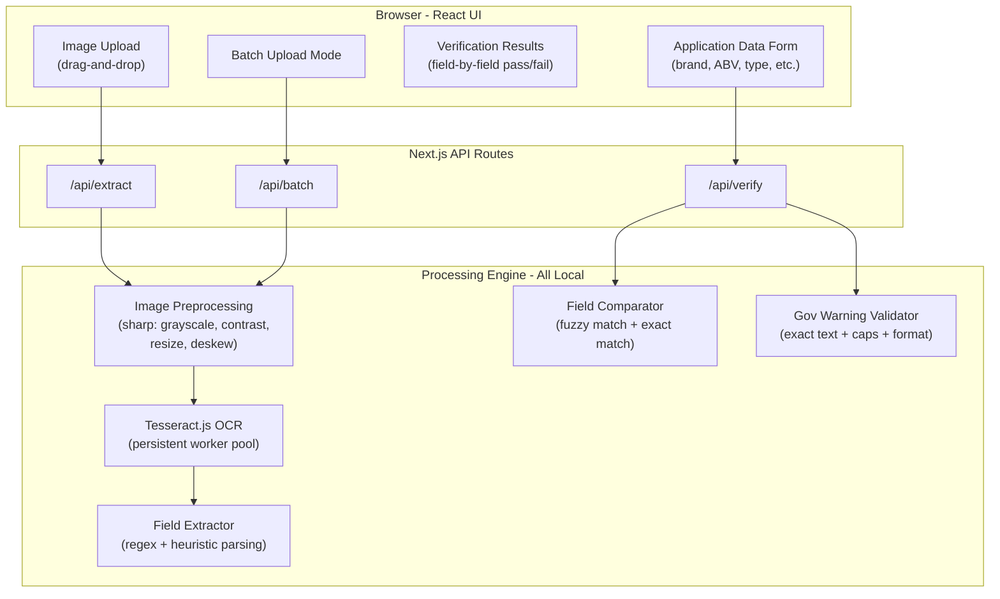

# TTB AI-Powered Alcohol Label Verification App -- Full Project Plan

## Stack Decision

**Next.js 14+ (TypeScript) full-stack, deployed to Railway**

- **Frontend**: React + Tailwind CSS + shadcn/ui (clean, accessible, "something my mother could figure out")
- **Backend**: Next.js API Routes (server-side processing)
- **OCR Engine**: Tesseract.js (latest) -- runs **locally on the server**, zero cloud API calls
- **Image Processing**: sharp (fast Node.js native image manipulation)
- **Fuzzy Matching**: string-similarity + custom logic (handles Dave's 'STONE'S THROW' vs 'Stone's Throw' scenario)
- **Deployment**: Railway (persistent Node.js server -- enables Tesseract worker reuse for speed)

### Why This Stack

- **No cloud API dependency** -- Tesseract.js is bundled with the app; OCR runs on the same server. Directly addresses Marcus's firewall concern.
- **Single codebase, single deployment** -- simpler to review, simpler to run. Evaluators get one URL.
- **TypeScript** -- type safety, self-documenting code, shows code quality (evaluation criterion).
- **shadcn/ui + Tailwind** -- accessible components out of the box, professional look, responsive. Half the team is 50+ (Sarah's benchmark).
- **Railway over Vercel** -- persistent server means Tesseract workers stay warm (~1s OCR vs ~5s cold start). Meets the 5-second SLA Sarah demanded.

---

## Architecture




---

## Core User Flow

1. **Agent uploads a label image** (drag-and-drop or file picker)
2. **Server preprocesses the image** (grayscale, contrast boost, resize) via sharp
3. **Tesseract.js extracts all text** from the label (~1-3 seconds with warm worker)
4. **Field extractor** parses raw OCR text into structured fields (brand, ABV, class/type, net contents, warning, etc.)
5. **Extracted fields are displayed** to the agent for review
6. **Agent enters application data** in a form (or it could be pre-filled / uploaded)
7. **Comparator runs field-by-field**:
  - Fuzzy match for brand name, class/type (handles case differences, minor punctuation)
  - Numeric match for ABV and net contents (normalize "45% Alc./Vol." vs "45%")
  - **Exact match** for Government Warning text + validates "GOVERNMENT WARNING:" is all caps
8. **Results page shows pass/fail per field** with confidence scores and explanations

---

## Project Structure

```
ttbgov/
├── docs/
│   ├── spec/                          # What they gave us (reference)
│   │   ├── Spec_...pdf                # Original PDF
│   │   ├── Spec_...md                 # Full spec markdown
│   │   ├── interviews.md              # Stakeholder interviews
│   │   ├── requirements.md            # Technical requirements
│   │   ├── sample.md                  # Sample label data
│   │   ├── deliverables.md            # Deliverables checklist
│   │   └── criteria.md               # Evaluation criteria
│   ├── considerations/                # Internal planning
│   │   ├── README.md                  # Folder index
│   │   ├── rationale.md               # Decision rationale (why this plan)
│   │   ├── risks.md                   # Risks and pivot points
│   │   └── assumptions.md             # Assumptions without confirmation
│   ├── APPROACH.md                    # NEW: Approach & decisions (submitted)
│   └── ARCHITECTURE.md                # NEW: Architecture docs (submitted)
├── src/
│   ├── app/                           # Next.js App Router
│   │   ├── layout.tsx                 # Root layout (header, nav, footer)
│   │   ├── page.tsx                   # Home / single label verification
│   │   ├── batch/
│   │   │   └── page.tsx               # Batch upload page
│   │   ├── about/
│   │   │   └── page.tsx               # About / how it works page
│   │   └── api/
│   │       ├── extract/
│   │       │   └── route.ts           # POST: upload image -> OCR -> fields
│   │       ├── verify/
│   │       │   └── route.ts           # POST: compare extracted vs application
│   │       └── batch/
│   │           └── route.ts           # POST: batch label processing
│   ├── components/
│   │   ├── ui/                        # shadcn/ui primitives (button, card, etc.)
│   │   ├── LabelUploader.tsx          # Drag-and-drop image upload
│   │   ├── ApplicationForm.tsx        # Form: brand, ABV, type, warning, etc.
│   │   ├── ExtractedFields.tsx        # Display OCR-extracted fields
│   │   ├── VerificationResults.tsx    # Pass/fail per field with details
│   │   ├── BatchUploader.tsx          # Multi-file upload + progress
│   │   ├── BatchResults.tsx           # Summary table of batch results
│   │   └── Header.tsx                 # App header / navigation
│   ├── lib/
│   │   ├── ocr/
│   │   │   ├── engine.ts              # Tesseract.js worker pool management
│   │   │   └── preprocessor.ts        # Image preprocessing pipeline (sharp)
│   │   ├── extraction/
│   │   │   ├── fieldExtractor.ts      # Parse OCR text -> structured fields
│   │   │   └── patterns.ts            # Regex patterns for label fields
│   │   ├── verification/
│   │   │   ├── comparator.ts          # Field-by-field comparison engine
│   │   │   ├── fuzzyMatch.ts          # Fuzzy string matching utilities
│   │   │   ├── warningValidator.ts    # Government warning exact validation
│   │   │   └── normalizers.ts         # ABV, volume, text normalizers
│   │   └── types.ts                   # Shared TypeScript types/interfaces
│   └── styles/
│       └── globals.css                # Tailwind base + custom styles
├── public/
│   └── test-labels/                   # Sample label images for testing
├── .env.example                       # Env var template (no secrets)
├── .gitignore                         # Updated for Node.js/Next.js
├── next.config.ts                     # Next.js + Tesseract.js webpack config
├── tailwind.config.ts
├── tsconfig.json
├── package.json
├── Dockerfile                         # For Railway deployment
└── README.md                          # Comprehensive project documentation
```

---

## Stakeholder Requirements Traceability

Every requirement from the interviews is addressed. This traceability itself will go into `docs/APPROACH.md` as evidence of "attention to requirements."

- **Sarah -- 5-second response time**: Tesseract worker pool stays warm; image preprocessing reduces OCR time. Target: under 3 seconds for single label.
- **Sarah -- "Something my mother could figure out"**: Large upload area, minimal form fields, obvious "Verify" button, color-coded results (green/red). No jargon.
- **Sarah -- Batch uploads (200-300 labels)**: Dedicated `/batch` page with multi-file upload, progress bar, summary table.
- **Marcus -- No cloud API dependency**: Tesseract.js runs on the app server. Zero outbound API calls for core functionality. Works behind any firewall.
- **Marcus -- Standalone prototype**: No COLA integration. Self-contained app.
- **Dave -- Fuzzy matching / judgment**: Brand name comparison uses fuzzy matching (similarity threshold). Case-insensitive. Punctuation-normalized. Confidence score shown.
- **Jenny -- Government Warning exact check**: Dedicated validator checks: (1) exact wording match, (2) "GOVERNMENT WARNING:" in all caps, (3) presence of both required sentences.
- **Jenny -- Handle imperfect images**: Image preprocessing pipeline: auto-contrast, grayscale conversion, sharpening, noise reduction. Graceful error messaging if OCR confidence is too low.

---

## Documentation Deliverables

These are critical for the evaluation criteria ("documentation of approach, tools used, assumptions made"):

### README.md

- Project overview and purpose
- Tech stack with rationale
- Prerequisites (Node.js 18+)
- Local setup: `npm install && npm run dev`
- Environment variables (if any)
- Deployed URL
- Screenshots of the app in action

### docs/APPROACH.md

- Problem analysis (what the spec is really asking for)
- How stakeholder interviews informed every design decision
- Why Next.js + Tesseract.js (local OCR, not cloud)
- Trade-offs and limitations acknowledged
- What would change for production (COLA integration, Azure deployment, FedRAMP)

### docs/ARCHITECTURE.md

- System architecture diagram
- Data flow: image upload -> OCR -> extraction -> verification
- Key modules and their responsibilities
- Performance considerations

---

## Test Label Strategy

Testing with realistic labels is critical to validating the OCR engine and proving the app works. We source labels from three places and organize them for easy evaluator testing.

### Label Sources

**1. TTB Public COLA Registry (real approved labels)**
- TTB maintains a free, public registry of all approved labels at https://www.ttbonline.gov/colasonline/publicSearchColasBasic.do
- No login required. Searchable by brand name, permit number, or date.
- Contains printable label images for COLAs issued 1999-present.
- We will download 3-5 real approved labels covering different beverage types (bourbon, wine, beer) to test against genuine label layouts, fonts, and formatting.

**2. AI-generated test labels (controlled scenarios)**
- The spec encourages this: "AI image generation tools work well for this."
- We generate labels with specific pass/fail conditions so we can demonstrate each verification feature:
  - Compliant label (all fields match -- should pass everything)
  - Wrong ABV (label says 40%, application says 45% -- should fail ABV check)
  - Title case warning ("Government Warning" instead of "GOVERNMENT WARNING:" -- should fail warning check)
  - Brand name case mismatch ("OLD TOM" on label, "Old Tom" in form -- should pass with fuzzy match)
  - Missing government warning entirely (should flag as missing)

**3. Imperfect image captures (preprocessing stress test)**
- Take a real or AI-generated label and degrade it: angle the photo, reduce contrast, add blur, simulate glare.
- Tests the sharp preprocessing pipeline (Jenny's concern about bad photos).
- Documents the boundary of what the OCR can and cannot handle.

### Folder Structure

```
public/test-labels/
├── real/                          # From TTB Public COLA Registry
│   ├── bourbon-example.jpg        # Real bourbon label
│   ├── wine-example.jpg           # Real wine label
│   └── beer-example.jpg           # Real beer label
├── generated/                     # AI-generated controlled test cases
│   ├── compliant-label.png        # Should pass all checks
│   ├── wrong-abv.png              # Should fail ABV
│   ├── wrong-warning-case.png     # Should fail warning
│   ├── brand-case-mismatch.png    # Should pass with fuzzy match
│   └── missing-warning.png        # Should flag missing field
├── degraded/                      # Imperfect image stress tests
│   ├── angled-shot.jpg            # Label at ~30 degree angle
│   ├── low-contrast.jpg           # Washed out / overexposed
│   └── blurry.jpg                 # Simulated motion blur
└── README.md                      # Describes each test case and expected result
```

### Test Case Documentation

Each test label will have a corresponding expected result documented in `public/test-labels/README.md` so evaluators (and we) can verify the app produces the correct output for every scenario.

---

## Deployment Plan

- **Platform**: Railway (free tier, persistent Node.js server)
- **Build**: `npm run build` produces optimized Next.js production build
- **Dockerfile**: Multi-stage build for minimal image size
- **URL**: Will be a `*.up.railway.app` URL shared with evaluators
- **Alternative**: If Railway has issues, Render.com as fallback (same approach)

---

## Implementation Order

The work is sequenced so we always have a working app, adding features incrementally. "A working core application with clean code is preferred over ambitious but incomplete features."

1. **Documentation init** -- Create skeleton README.md, APPROACH.md, ARCHITECTURE.md with everything we already know. These are living documents updated throughout.
2. **Project init** -- Scaffold Next.js, TypeScript, Tailwind, shadcn/ui. Replace .gitignore. Set up folder structure.
3. **OCR engine** -- Tesseract.js worker pool + sharp preprocessing. **Validate risk #1 (accuracy) and assumption A1/A2 here.**
4. **Field extraction** -- Regex + heuristic parsing of OCR text into structured fields. **Validate risk #3 here.**
5. **Verification logic** -- Comparator, fuzzy matching, government warning validator. **Validate risk #4 here.**
6. **API routes** -- Wire /api/extract, /api/verify, /api/batch endpoints.
7. **UI (single label)** -- Upload, form, results. **Shippable MVP after this step.**
8. **UI (batch)** -- Multi-file upload, progress, summary table.
9. **Test labels** -- Create 4-5 test images covering pass/fail scenarios.
10. **Deploy** -- Dockerfile, Railway, verify live URL. **Validate risks #2, #7, #10 here.**
11. **Documentation final** -- Screenshots, deployed URL, polish all docs.