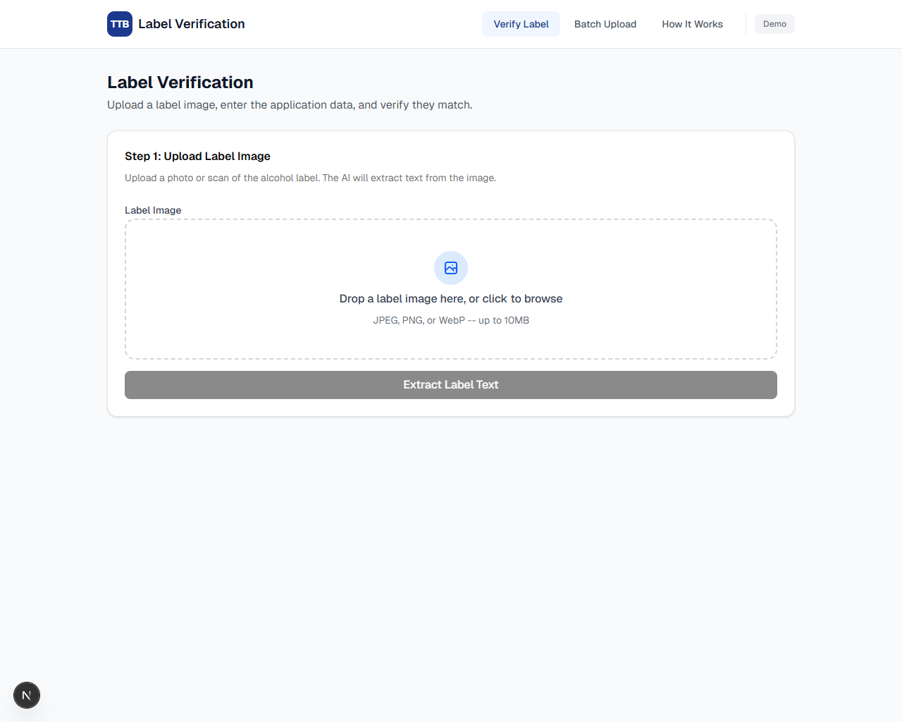
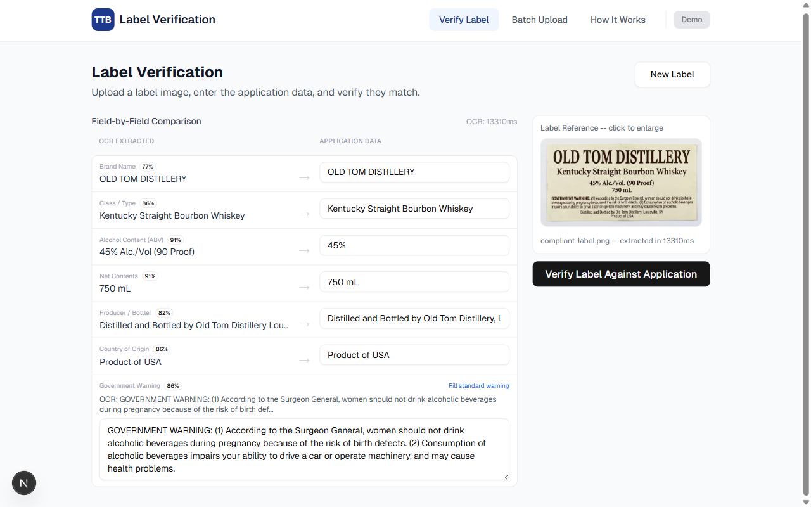
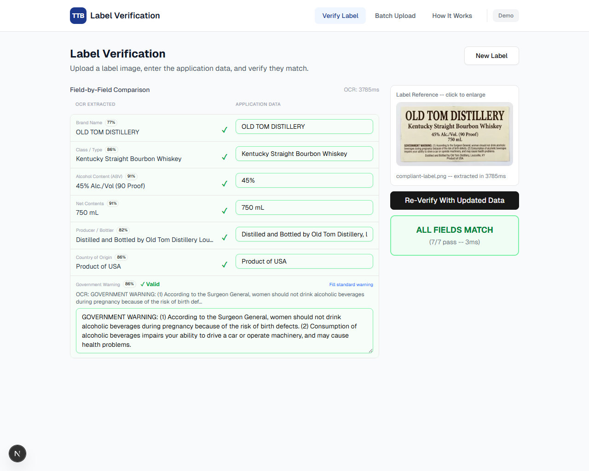

# TTB Label Verification App

An AI-powered tool that helps TTB compliance agents verify alcohol beverage labels against application data. Upload a label image, enter the application details, and get instant field-by-field verification results.

Built as a standalone prototype for the Alcohol and Tobacco Tax and Trade Bureau (TTB).

> **Live Demo:** https://ttb-label-verification.delightfulbeach-49152395.eastus.azurecontainerapps.io

---

## Screenshots

### Upload a label image


### AI extracts fields from the label and shows them alongside the application form


### Color-coded verification results with per-field pass/fail and confidence scores


---

## Quick Start

### Prerequisites

- Node.js 18+ ([download](https://nodejs.org/))
- npm (included with Node.js)

### Local Setup

```bash
git clone https://github.com/Suntek-Solutions/ttbgov.git
cd ttbgov
npm install
npm run dev
```

Open [http://localhost:3000](http://localhost:3000) in your browser.

### Environment Variables

```bash
cp .env.example .env.local
```

> No external API keys are required. All processing runs locally on the server.

---

## What It Does

A compliance agent reviews ~150,000 label applications per year. Each review involves comparing what's printed on a physical label against what's declared in the application. This tool automates that comparison:

1. **Upload** a label image (drag-and-drop or file picker)
2. **AI extracts** all text from the label using dual OCR engines (ONNX PaddleOCR primary + Tesseract.js conditional fallback), both running locally with no cloud APIs
3. **Enter application data** in a simple form (brand name, ABV, class/type, etc.)
4. **Get instant results** -- field-by-field pass/fail with confidence scores

### Key Features

- **Single label verification** -- the core workflow: upload, extract, compare, verify
- **Batch upload** -- process multiple labels at once for high-volume importers
- **Fuzzy matching** -- handles case and punctuation differences ("STONE'S THROW" vs "Stone's Throw")
- **Government warning validation** -- exact text match with all-caps prefix check per TTB requirements
- **Image preprocessing** -- grayscale, contrast enhancement, sharpening for imperfect photos
- **Sub-5-second response** -- warm OCR worker pool keeps processing fast after initial load

---

## Tech Stack

| Layer | Technology | Why |
|---|---|---|
| Framework | Next.js 16 (TypeScript) | Single codebase, single deployment, type-safe |
| UI | React 19 + Tailwind CSS 4 + shadcn/ui | Accessible, clean, responsive -- usable by non-technical staff |
| OCR | ONNX PaddleOCR (primary) + Tesseract.js (conditional fallback) | Dual local OCR: PaddleOCR PP-OCRv4 for high accuracy, Tesseract.js conditional fallback. Max 3 passes. Zero cloud dependency |
| Pattern Extraction | Universal regex + fuzzy matching | TTB-standard patterns for ABV, net contents, warning, producer, origin, class/type. No hardcoded country lists. |
| Image Processing | sharp | Preprocessing pipeline (1200px grayscale + normalize + sharpen) with threshold and inversion variants |
| Fuzzy Matching | string-similarity-js | Case/punctuation-normalized comparison with confidence scores |
| Deployment | Azure Container Apps | Persistent container, always-on, aligns with TTB's Azure infrastructure |

### Why Local OCR Instead of Cloud AI?

The TTB network blocks outbound traffic to many domains. A previous vendor's cloud ML endpoints were blocked by the firewall. Both OCR engines (ONNX PaddleOCR and Tesseract.js) run entirely on the app server -- zero outbound API calls for core functionality. See [docs/APPROACH.md](docs/APPROACH.md) for the full decision rationale.

---

## Documentation Guide

| Question | Document |
|---|---|
| How do I set up and run this? | You're here -- see [Quick Start](#quick-start) above |
| How do I use this tool? | Visit the [How It Works](/about) page in the app -- plain-language walkthrough for all experience levels |
| Why were these technologies chosen? | [docs/APPROACH.md](docs/APPROACH.md) -- maps every stakeholder interview to a design decision |
| How does the system work technically? | [docs/ARCHITECTURE.md](docs/ARCHITECTURE.md) -- system diagrams, data flow, API specs, TypeScript interfaces |
| What could go wrong and how would you handle it? | [docs/considerations/risks.md](docs/considerations/risks.md) -- 10 risks ranked by severity with pivot strategies |
| What assumptions were made? | [docs/considerations/assumptions.md](docs/considerations/assumptions.md) -- 12 assumptions with confidence ratings |
| Why this specific plan? | [docs/considerations/rationale.md](docs/considerations/rationale.md) -- full decision tree for every architectural choice |
| How was this built? Who did what? | [docs/APPROACH.md#development-process--transparency](docs/APPROACH.md#development-process--transparency) -- full transparency on AI-assisted development |
| What was the development process? | [docs/ACTIVITY_LOG.md](docs/ACTIVITY_LOG.md) -- timestamped session log of every step taken |
| What are the TTB labeling requirements? | [docs/label-research-requirements.md](docs/label-research-requirements.md) -- research summary from ttb.gov covering all 3 beverage types |
| How were test labels sourced? | [public/test-labels/README.md](public/test-labels/README.md) -- 5 AI-generated labels with expected results + 3 COLA registry datasets |

---

## Project Structure

```
ttbgov/
├── docs/
│   ├── APPROACH.md              # Approach, decisions, trade-offs
│   ├── ARCHITECTURE.md          # System architecture and data flow
│   ├── ACTIVITY_LOG.md          # Development session history
│   ├── spec/                    # Original project spec and breakdowns
│   └── considerations/          # Planning: rationale, risks, assumptions
├── src/
│   ├── app/                     # Next.js App Router (pages + API routes)
│   │   ├── page.tsx             # Single-label verification (main flow)
│   │   ├── batch/page.tsx       # Batch upload page
│   │   ├── about/page.tsx       # How It Works page
│   │   └── api/                 # REST endpoints (extract, verify, batch)
│   ├── components/              # React UI components
│   └── lib/                     # Core processing logic
│       ├── ocr/                 # Dual OCR (ONNX PaddleOCR + Tesseract.js) + sharp preprocessing
│       ├── extraction/          # OCR text → structured fields (regex + heuristics)
│       └── verification/        # Field comparison (fuzzy, numeric, exact)
├── public/test-labels/          # Test labels (generated + COLA reference data)
├── scripts/                     # Deployment + test scripts
├── Dockerfile                   # Production container (platform-agnostic)
└── README.md
```

---

## Trade-offs & Limitations

### Architectural Trade-offs

| Decision | Trade-off | Why we accepted it |
|---|---|---|
| Dual local OCR over cloud AI | Lower accuracy on very complex layouts (mitigated by dual-engine + multi-pass) | No cloud dependency, works behind firewalls, meets the constraint Marcus described |
| Fuzzy matching for text fields | Could allow false positives on genuinely different names | Dave's example showed exact matching produces false negatives that are worse for workflow |
| No persistent storage | Results not saved between sessions | Marcus said "don't do anything crazy" -- prototype scope, no data retention needed |
| No COLA integration | Agent enters data manually | Standalone prototype per spec -- COLA integration is a production concern |

See [docs/APPROACH.md](docs/APPROACH.md) for the complete trade-off analysis.

### Known Limitations (Boundary Cases)

This system was tested against 59 diverse labels (5 AI-generated + 54 real COLA registry images) to understand boundary cases:

**Image Quality Impacts Accuracy:**
- **High-quality scans/photos** (AI-generated test labels): 6.2/7 fields avg (89%)
- **Best real COLA labels** (wine bottles, clear photos): 7/7 fields
- **Typical COLA registry images** (compressed, variable quality): 3.9/7 fields avg (56%)

The COLA registry images are real-world data from TTB's public database, but they're optimized for human review (small file sizes, variable lighting, angled photos). OCR performs best on:
- Flat, well-lit scans or straight-on photos
- High contrast (dark text on light backgrounds)
- Minimal glare or bottle curvature
- Resolution > 800px width

**What still challenges OCR:**
- Vertical or curved text following bottle contours
- Highly decorative fonts (Gothic, script, heavy embellishment)
- Text printed on dark/textured backgrounds
- Very small font sizes (< 8pt equivalent)
- Graphical logos without readable text
- Severely compressed or low-resolution images

**Production Note:** The OCR adapter architecture (see "What Would Change for Production") would add cloud OCR engines that handle these edge cases better, while maintaining local fallback for firewall-restricted environments.

---

## Deployment

### Azure Container Apps (primary)

Deployed to Azure Container Apps, consistent with TTB's existing Azure infrastructure:

```bash
az login
./scripts/deploy-azure.sh
```

All configuration is driven by environment variables with sensible defaults. See the script for details.

### Docker (run anywhere)

The app ships as a standard Docker container that runs on any platform:

```bash
docker build -t ttb-label-verification .
docker run -p 3000:3000 ttb-label-verification
```

---

## What Would Change for Production

This is a prototype. A production deployment at TTB would require:

- **OCR Adapter Architecture** (critical enhancement): If outbound network access is allowed, add an OCR adapter layer with pluggable engines (Azure Document Intelligence, Azure Vision OCR, Google Document AI, AWS Textract). The app would choose the best engine available and automatically fall back to the local dual-engine (ONNX + Tesseract) when blocked by firewalls. **The current 100% local approach was a deliberate architectural choice** to handle firewall restrictions, but the adapter pattern makes cloud OCR a simple plug-in for production.
- **COLA system integration** for automated application data import
- **User authentication and RBAC** for agent accounts
- **Audit logging** and document retention per federal compliance requirements
- **Database** for processing history, batch tracking, and reporting
- **Section 508 accessibility compliance** audit
- **Load testing** for 150,000 labels/year throughput across 47 concurrent agents

---

*Built by Scott Vidito as a take-home exercise for the TTB IT Specialist position.*
