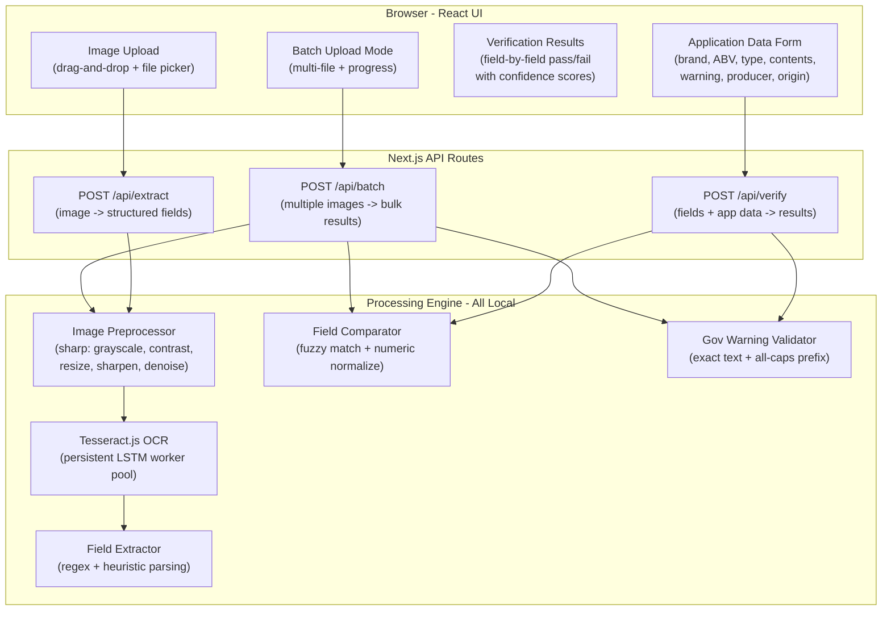
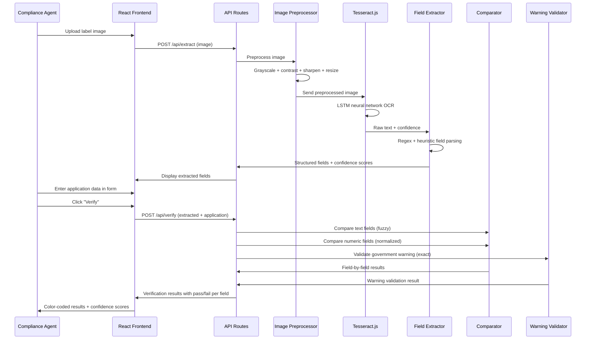
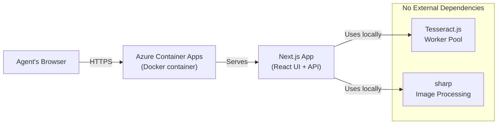

# Architecture

System architecture, data flow, and module responsibilities for the TTB Label Verification App.

---

## System Overview



---

## Data Flow: Single Label Verification



---

## Module Responsibilities

### `src/lib/ocr/`

| File | Responsibility |
|---|---|
| `engine.ts` | Manages Tesseract.js worker pool. Creates workers on server startup, keeps them warm between requests, handles cleanup. Exposes a simple `recognize(imageBuffer)` interface to the rest of the app. |
| `preprocessor.ts` | Image preprocessing pipeline using sharp. Takes a raw image buffer, applies grayscale conversion, contrast enhancement, sharpening, noise reduction, and resize. Returns an optimized buffer ready for OCR. |

### `src/lib/extraction/`

| File | Responsibility |
|---|---|
| `fieldExtractor.ts` | Takes raw OCR text and parses it into structured fields: brand name, class/type, ABV, net contents, government warning, producer name/address, country of origin. Returns a typed `ExtractedFields` object with confidence scores per field. |
| `patterns.ts` | Regex patterns and heuristics for identifying label fields. ABV patterns (e.g., `XX% Alc./Vol.`), volume patterns (e.g., `750 mL`), government warning detection, brand name position heuristics. |

### `src/lib/verification/`

| File | Responsibility |
|---|---|
| `comparator.ts` | Field-by-field comparison engine. Dispatches each field to the appropriate comparison strategy: fuzzy match for text, numeric normalization for ABV/volume, exact match for warning. Returns a `VerificationResult` per field. |
| `fuzzyMatch.ts` | String similarity utilities. Normalizes case, strips punctuation, computes similarity score. Configurable threshold (default 85%). |
| `warningValidator.ts` | Government warning-specific validation. Checks: (1) "GOVERNMENT WARNING:" prefix is present and all caps, (2) body text matches expected warning within high threshold (95%+), (3) both required sentences are present. |
| `normalizers.ts` | Normalization functions for ABV (extract numeric value from "45% Alc./Vol. (90 Proof)") and net contents (extract numeric value and unit from "750 mL"). Enables numeric comparison regardless of formatting. |

### `src/lib/types.ts`

Shared TypeScript interfaces used across all modules (from `src/lib/types.ts`):

```typescript
interface FieldResult {
  value: string | null;
  confidence: number;  // 0-1
}

interface ExtractedFields {
  brandName: FieldResult;
  classType: FieldResult;
  alcoholContent: FieldResult;
  netContents: FieldResult;
  governmentWarning: FieldResult;
  producerInfo: FieldResult;
  countryOfOrigin: FieldResult;
  rawText: string;
}

interface ApplicationData {
  brandName: string;
  classType: string;
  alcoholContent: string;
  netContents: string;
  governmentWarning: string;
  producerInfo?: string;
  countryOfOrigin?: string;
}

type ComparisonMethod = "fuzzy" | "exact" | "numeric";

interface FieldVerificationResult {
  field: string;
  extracted: string | null;
  expected: string;
  match: boolean;
  confidence: number;
  method: ComparisonMethod;
  details: string;
}

interface VerificationResult {
  overall: "pass" | "fail";
  results: FieldVerificationResult[];
  processingTimeMs: number;
}
```

---

## API Routes

### `POST /api/extract`

Accepts a label image, runs OCR, returns structured fields.

**Request:** `multipart/form-data` with image file

**Response:**
```json
{
  "success": true,
  "fields": {
    "brandName": { "value": "OLD TOM DISTILLERY", "confidence": 0.94 },
    "classType": { "value": "Kentucky Straight Bourbon Whiskey", "confidence": 0.91 },
    "alcoholContent": { "value": "45% Alc./Vol. (90 Proof)", "confidence": 0.97 },
    "netContents": { "value": "750 mL", "confidence": 0.95 },
    "governmentWarning": { "value": "GOVERNMENT WARNING: ...", "confidence": 0.88 },
    "producerInfo": { "value": null, "confidence": 0 },
    "countryOfOrigin": { "value": null, "confidence": 0 }
  },
  "rawText": "...",
  "processingTimeMs": 2340
}
```

### `POST /api/verify`

Accepts extracted fields + application data, returns verification results.

**Request:** `application/json`
```json
{
  "extracted": { ... },
  "application": {
    "brandName": "OLD TOM DISTILLERY",
    "classType": "Kentucky Straight Bourbon Whiskey",
    "alcoholContent": "45%",
    "netContents": "750 mL",
    "governmentWarning": "GOVERNMENT WARNING: (1) According to the Surgeon General..."
  }
}
```

**Response:**
```json
{
  "success": true,
  "overall": "fail",
  "results": [
    { "field": "brandName", "match": true, "confidence": 0.98, "method": "fuzzy", "details": "Exact match after normalization" },
    { "field": "alcoholContent", "match": true, "confidence": 1.0, "method": "numeric", "details": "45% = 45%" },
    { "field": "governmentWarning", "match": false, "confidence": 0.72, "method": "exact", "details": "Prefix 'Government Warning' is not all caps" }
  ],
  "processingTimeMs": 45
}
```

### `POST /api/batch`

Accepts multiple label images, processes them in parallel batches of 3, returns extraction results per file.

**Request:** `multipart/form-data` with multiple "images" file fields (max 50 files)

**Response:**
```json
{
  "success": true,
  "results": [
    {
      "filename": "bourbon-label.png",
      "extraction": {
        "brandName": { "value": "OLD TOM DISTILLERY", "confidence": 0.74 },
        "classType": { "value": "Kentucky Straight Bourbon Whiskey", "confidence": 0.83 },
        "alcoholContent": { "value": "45% Alc./Vol.", "confidence": 0.87 },
        "netContents": { "value": "750 mL", "confidence": 0.87 },
        "governmentWarning": { "value": "GOVERNMENT WARNING: ...", "confidence": 0.85 },
        "producerInfo": { "value": null, "confidence": 0 },
        "countryOfOrigin": { "value": "Product of USA", "confidence": 0.83 },
        "rawText": "..."
      }
    },
    {
      "filename": "wine-label.png",
      "extraction": null,
      "error": "Unsupported file type: application/pdf"
    }
  ],
  "totalProcessingTimeMs": 2450
}
```

---

## Performance Architecture

| Optimization | Target | Rationale |
|---|---|---|
| Persistent Tesseract worker pool | Eliminate cold start | Workers load WASM + language data once on server boot (~3-5s). Subsequent requests skip this entirely. |
| Image preprocessing before OCR | Reduce OCR processing time + improve accuracy | Grayscale + contrast + resize takes ~100-200ms but can cut OCR time significantly by providing cleaner input. |
| Azure Container Apps (always-on) | Keep workers warm | Serverless (Vercel) spins down between requests, triggering cold starts. Azure Container Apps keeps the process running. |
| Parallel batch processing | Handle bulk uploads | Process 3-5 labels concurrently to balance throughput against memory constraints. |

**Target:** Under 5 seconds end-to-end for single label verification (from image upload arrival to results display).

---

## Deployment Architecture



- **Single deployment** on Azure Container Apps as a Docker container
- **No external service dependencies** at runtime
- **No database** -- all processing is stateless and in-memory
- **Dockerfile** uses multi-stage build for minimal image size
